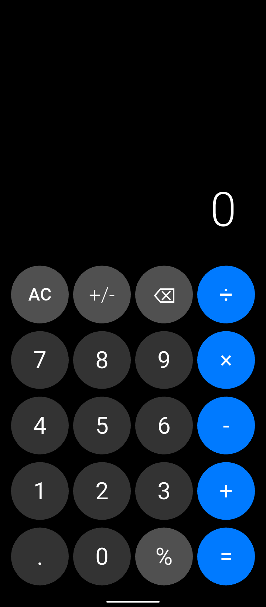
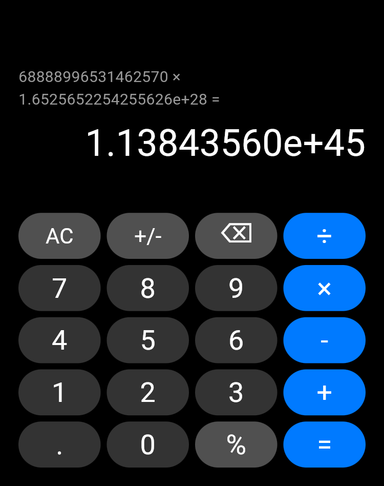
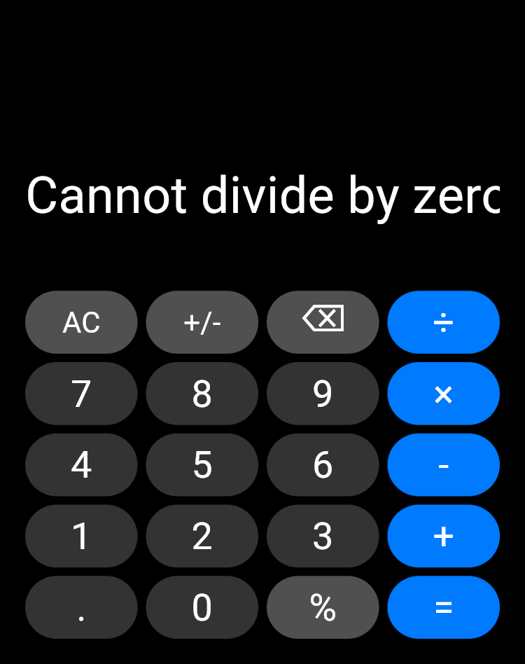
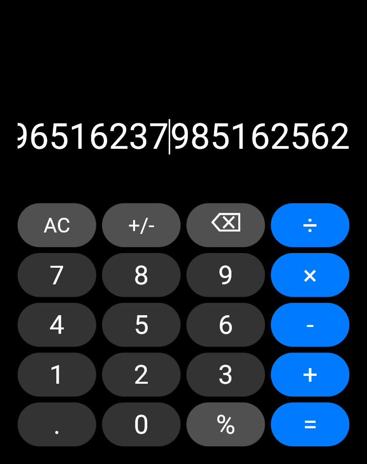

# Calculator App 🧮

A modern, high-precision calculator app built with Flutter. Features a sleek dark theme, advanced input capabilities, and comprehensive mathematical operations with intelligent error handling.

## ✨ Features

- **Modern Design**: Dark theme with rounded buttons and clean typography
- **Basic Operations**: Addition (+), Subtraction (-), Multiplication (×), Division (÷)
- **Advanced Functions**:
  - Percentage calculations (%) - context-aware like mobile calculators
  - Sign toggle (+/-)
  - All Clear (AC)
  - Backspace (⌫) for precise editing
- **High-Precision Input**:
  - Support for up to 100-digit numbers
  - Enhanced large number calculation capabilities
  - Intelligent overflow handling (up to 1e50)
- **Smart Display**:
  - Previous expression history
  - Auto-sizing text based on number length
  - Horizontal scrolling for long numbers
  - Tap-to-position cursor functionality
  - Scientific notation for very large results
- **Error Handling**:
  - Division by zero protection
  - Advanced overflow detection for large numbers
  - Invalid operation handling
  - Input validation and length limits
- **User Experience**:
  - Haptic feedback on button presses
  - Responsive button animations
  - Interactive cursor positioning
  - Clean, intuitive interface

## 📸 Screenshots

<div align="center">
  
  
  
  
</div>

_Showcasing the modern dark theme, large number support, and interactive cursor positioning_

## 🚀 Getting Started

### Prerequisites

- Flutter SDK (>=3.0.0)
- Dart SDK (>=3.0.0)
- Android Studio / VS Code with Flutter extensions

### Installation

1. Clone the repository:

```bash
git clone <repository-url>
cd calculator_app
```

2. Get dependencies:

```bash
flutter pub get
```

3. Run the app:

```bash
flutter run
```

### Supported Platforms

- ✅ Android
- ✅ iOS
- ✅ Web
- ✅ Windows
- ✅ macOS
- ✅ Linux

## 🏗️ Architecture

The app follows a clean, modular architecture for better maintainability:

```
lib/
├── main.dart              # App entry point and theme setup
├── calculator_page.dart   # Main calculator logic and UI
├── buttons.dart          # Button components and styling
└── calculator_utils.dart # Utility functions and helpers
```

### Key Components

- **MyApp**: Root application widget with theme configuration
- **CalculatorPage**: Main calculator interface and state management
- **CalculatorButton**: Reusable button component with styling
- **CalculatorUtils**: Utility functions for number formatting and validation

## 🧮 How It Works

### Percentage Calculations

The calculator implements context-aware percentage calculations like mobile calculators:

- `100 - 4%` = `96` (calculates 4% of 100, then subtracts)
- `200 + 15%` = `230` (calculates 15% of 200, then adds)
- `50 × 20%` = `500` (calculates 20% of 50, then multiplies)

### Error Handling

- **Division by Zero**: Shows "Cannot divide by zero" message
- **Number Overflow**: Detects and handles very large numbers
- **Invalid Operations**: Graceful handling of mathematical errors
- **Input Validation**: Prevents multiple decimal points and invalid inputs

## 🎨 Design System

### Colors

- **Background**: `#000000` (Pure Black)
- **Display Area**: `#000000` with white text
- **Number Buttons**: `#333333` (Dark Gray)
- **Function Buttons**: `#505050` (Medium Gray)
- **Operator Buttons**: `#007AFF` (Blue)
- **Text Colors**: White primary, `#999999` for secondary

### Typography

- **Display Numbers**: 64px (48px for long numbers)
- **Previous Expression**: 20px
- **Button Text**: 36px (28px for multi-character)
- **Font Weight**: Light (300) for display, Regular (400) for buttons

## 🔧 Development

### Code Structure

```dart
// Button types for styling
enum ButtonType { function, operator, number }

// Main calculator state
class _CalculatorPageState {
  String _display = "0";
  String _previousExpression = "";
  double _num1 = 0, _num2 = 0;
  String _operator = "";
  bool _shouldResetDisplay = false;
  bool _hasError = false;
}
```

### Adding New Features

1. **New Operations**: Add cases to the `_calculate()` method
2. **New Buttons**: Use `CalculatorButton.build()` with appropriate `ButtonType`
3. **New Utilities**: Add static methods to `CalculatorUtils`

### Testing

```bash
# Run unit tests
flutter test

# Run integration tests
flutter drive --target=test_driver/app.dart
```

## 📱 Usage Examples

### Basic Operations

```
2 + 3 = 5
10 - 4 = 6
7 × 8 = 56
15 ÷ 3 = 5
```

### Percentage Calculations

```
100 - 20% = 80  (20% of 100 = 20, then 100 - 20)
50 + 10% = 55   (10% of 50 = 5, then 50 + 5)
```

### Advanced Functions

```
42 +/- = -42    (Toggle sign)
-15 +/- = 15    (Toggle sign back)
AC              (Clear everything)
⌫               (Backspace/Delete last digit)
```

### Large Number Operations

```
123456789012345 + 987654321098765 = 1.11111111011111e+15
999999999999999 × 999999999999999 = 9.99999999999998e+29
```

### Interactive Features

- **Tap Display**: Tap anywhere on the number display to position cursor
- **Cursor Editing**: Insert or delete digits at any position
- **Scientific Notation**: Automatic conversion for numbers ≥ 1e15
- **Overflow Protection**: Calculations protected up to 1e50

## 🤝 Contributing

1. Fork the repository
2. Create a feature branch (`git checkout -b feature/amazing-feature`)
3. Commit your changes (`git commit -m 'Add amazing feature'`)
4. Push to the branch (`git push origin feature/amazing-feature`)
5. Open a Pull Request

## 📄 License

This project is licensed under the MIT License - see the [LICENSE](LICENSE) file for details.

## 🙏 Acknowledgments

- Built with Flutter framework
- Uses Material Design principles
- Inspired by modern calculator designs
